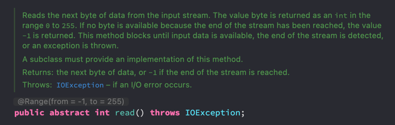

# Java I/O

- I/O 간단히 이야기해서 **Input / Output**. 즉, 입력과 출력을 뜻한다.

## Stream

- 어느 한쪽에서 데이터를 전달하려면 **두 대상을 연결하고 데이터를 전달할 수 있는 무언가가 필요한데 이것을 Stream** 이라고 한다.
- Stream 은 **단방향 통신**으로 Input / Output 작업을 동시에 수행할 수 없다.
  - 그래서 입/출력을 위해서는 InputStream, OutputStream 총 두개가 필요하다.

### 바이트 기반 스트림(InputStream / OutputStream)

| 입력스트림                | 출력스트림                 | 대상           |
|----------------------|-----------------------|--------------|
| FileInputStream      | FileOutputStream      | File         |
| ByteArrayInputStream | ByteArrayOutputStream | ByteArray    |
| PipedInputStream     | PipedOutputStream     | Process      |
| AudioInputStream     | AudioOutputStream     | Audio Device |

- 위의 클래스들은 기본적으로 InputStream / OutputStream 의 자손들이며, **추상 메소드로 구현된 `read()` 를 각각의 방식에 맞게 구현**하고 있다.
따라서 입출력의 대상이 달라져도 기본적으로 **동일한 방법으로 입/출력이 가능**하기 때문에 사용하기 편리하다.
- 아래와 사진과 같이 read() 가 추상메소드이다. 
  

## 보조 Stream

보조 Stream 은 Stream 의 기능을 보조하기 위한 역할이다. 따라서 **보조 Stream 만으로는 입/출력을 수행할 수 없고**, Stream 을 생성한다음 이를 이용해
보조 Stream 을 생성하여야 한다.

- **예시코드**

```java
FileInputStream fis = new FileInputStream("file.txt");
BufferedInputStream bi = new BufferedInputStream(fis);
bi.read();
```

- **종류**

| 입력스트림                 | 출력                   | 설명                                  |
|-----------------------|----------------------|-------------------------------------|
| FilterInputStream     | FilterOutputStream   | 필터를 이용한 입출력 처리                      |
| BufferedInputStream   | BufferedOutputStream | 버퍼를 이용한 입출력 처리                      |
| DataInputStream       | DataOutputStream     | 기본형(primitive) 데이터 데이터 형태로 처리       |
| SequenceInputStream   | X                    | 두개의 스트림을 하나로 연결                     |
| LineNumberInputStream | X                    | 읽어온 데이터의 라인번호를 카운트                  |
| ObjectInputStream     | ObjectOutputStream   | 데이터를 객체형태로 읽고 쓰는데 사용. 객체 직렬화와 연관있음. |
| X                     | PrintStream          | 버퍼를 이용하여 추가적인 프린트 기능 (println)      |
| PushbackInputStream   | X                    | 버퍼를 이용해서 읽어온 데이터를 다시 되돌리는 기능        |

## ByteArrayStream

** ByteArrayInputStream / ByteArrayOutputStream ** 은 메모리에 데이터를 입출력하는데 이용하는 스트림이다.

- **예시코드**

```java
public class ByteArrayInputAndOutputStreamExample {

    public static void main(String[] args) {
        byte[] inSrc = {0,1,2,3,4,5,6};
        byte[] outSrc = null;

        ByteArrayInputStream inputStream = new ByteArrayInputStream(inSrc);
        ByteArrayOutputStream outputStream = new ByteArrayOutputStream();

        int data;

        /**
         * read() Method 는 1 Byte 씩 읽어오는 역할을 한다.
         * -1 의 경우는 읽어올 데이터가 없는 경우를 뜻한다.
         */
        while ((data = inputStream.read()) != -1) {
            outputStream.write(data);
        }

        outSrc = outputStream.toByteArray();

        System.out.println(Arrays.toString(inSrc));
        System.out.println(Arrays.toString(outSrc));
    }

}
```

- 특징 
  - ByteArrayStream 은 위에서 언급했듯이 메모리에 입출력을 하기 때문에 GC 의 관리 대상이 된다. 따라서 `close()` 를 이용해서 닫지 않아도 된다.

- **배열을 이용한 ByteStream 최적화**

```java
    private static final int BUFFER_SIZE = 4;

    public static void main(String[] args) {

        byte[] inSrc = {0,1,2,3,4,5,6};
        byte[] buffer = new byte[BUFFER_SIZE];
        byte[] outSrc = null;

        ByteArrayInputStream inputStream = new ByteArrayInputStream(inSrc);
        ByteArrayOutputStream outputStream = new ByteArrayOutputStream();

        int data;

        System.out.println("Input Source : " + Arrays.toString(inSrc));

        try {
            while (inputStream.available() > 0) {
                /**
                 * read 에 byte[] 를 넣으면 buffer 이다.
                 */
                inputStream.read(buffer);
                outputStream.write(buffer);
                System.out.println("Buffer Pool(Before) : " + Arrays.toString(buffer));

                outSrc = outputStream.toByteArray();
                System.out.println("Buffer Pool(After) : " + Arrays.toString(buffer));
                System.out.println("Output Source : " + Arrays.toString(outSrc));
                
            }
        } catch (IOException ignored) {}

        System.out.println(Arrays.toString(inSrc)); // [0, 1, 2, 3, 4, 5, 6]
        System.out.println(Arrays.toString(outSrc)); // [0, 1, 2, 3, 4, 5, 6, 3]
    }

```

- 문제점
  - 위의 BufferSize 만큼 남는 경우 이상한 값이 들어오게 된다. Buffer read 방식의 경우 기존의 Buffer 를 채워가며 읽는 식인데, 마지막에는 4,5,6 세개만 읽으므로
기존에 있던 3이 남아있게 된다. 따라서 Buffer 를 어떻게 끊어야 할지 잘 고민해야 한다. 따라서 아래와 같은 방식으로 최적화가 가능하다.

```java
    public static void main(String[] args) {

        byte[] inSrc = {0,1,2,3,4,5,6};

        byte[] outSrc = null;

        ByteArrayInputStream inputStream = new ByteArrayInputStream(inSrc);
        ByteArrayOutputStream outputStream = new ByteArrayOutputStream();

        System.out.println("Input Source : " + Arrays.toString(inSrc));

        try {
            while (inputStream.available() > 0) {

                int bufferSize = inputStream.available();
                System.out.println("Blocking 없이 읽어올 수 있는 Byte 수 : " + bufferSize);
                byte[] buffer = new byte[bufferSize];
                /**
                 * read 에 byte[] 를 넣으면 buffer 이다.
                 */
                inputStream.read(buffer);
                outputStream.write(buffer);
                System.out.println("Buffer Pool(Before) : " + Arrays.toString(buffer));

                outSrc = outputStream.toByteArray();
                System.out.println("Buffer Pool(After) : " + Arrays.toString(buffer));
                System.out.println("Output Source : " + Arrays.toString(outSrc));

            }
        } catch (IOException ignored) {}

        System.out.println(Arrays.toString(inSrc)); // [0, 1, 2, 3, 4, 5, 6]
        System.out.println(Arrays.toString(outSrc)); // [0, 1, 2, 3, 4, 5, 6]
    }
```