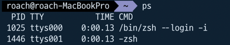
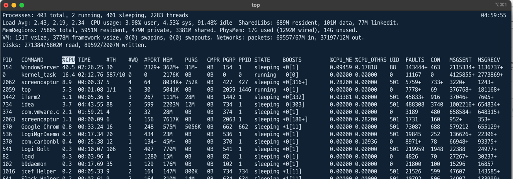

# Process 

Process 란 간단히 말해서 **실행중인 프로그램**이다. Process 는 OS 에게 실행에 필요한 자원을 할당받게 된다.
**OS 로 부터 자원을 할당받아 실행되는 프로그램을 프로세스** 라고 한다.

Mac 의 경우 ps 라는 명령어를 쳤을때 아래 화면처럼 실행중인 프로세스와 Process ID 를 확인가능하다.

기본적으로 Process 는 내부 Instruction 을 실행 시키기 위해서 **하나 이상의 Thread** 를 가진다. (Thread 는 하단 Thread 에서 설명)

## Multi-Tasking

멀티 태스킹이란 다수의 Task 를 Concurrent 하게 실행시키는 것이다. 

## Thread

Process 는 내부적으로 실제 작업을 수행하기 위해서는 **Thread** 라는 일꾼을 이용한다.
하나 또는 다수의 스레드를 소유할 수 있으며, 다수의 스레드의 경우 Concurrency 처리가 가능하다.

